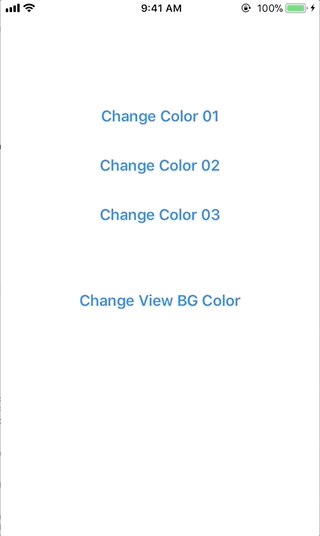

# RappleColorPicker

[](http://cocoapods.org/pods/RappleColorPicker)
[](http://cocoapods.org/pods/RappleColorPicker)
[](http://cocoapods.org/pods/RappleColorPicker)

## Requirements
- Xcode 8
- Swift 3
- iOS 8+

## Example App

To run the example project, clone the repo, and run `pod install` from the Example directory first.

## Installation

RappleColorPicker is available through [CocoaPods](http://cocoapods.org). To install
it, simply add the following line to your Podfile:

```ruby
pod "RappleColorPicker"
```

First import color picker pod in your Swift class

```ruby
import RappleColorPicker
```

Parameters required to open color pallet

- `onViewController` viewController to open color palet - this parameter cannot be nil
- `origin` origin point of the color pallet - Default : CGPoint.zero
- `delegate` RappleColorPickerDelegate
- `title` color pallet name, send nil to hide the title bar
- `tag` identification tag
- `attributes` look and feel attribute dictionary (Title, BGColor, TintColor, Style, BorderColor)

`attribute` dictionary should have these key values located in `RappleCPAttributeKey` enum.
If any of the key cannot be located in attributes default values will use to create UIs
```ruby
enum RappleCPAttributeKey {
    case Title          `Title text - attributes without Title will hide title bar from UI`
    case BGColor        `Background color`
    case Style          `Cell style (Square, Circle)`
    case TintColor      `TintColor Tint Color (Text color, cell border color)`
    case BorderColor    `Color pallet border Color (Complete pallet border)`
}
```
`Style` key must have one of the these styles
- `RappleCPStyleSquare` // Squre shaped color picker cells
- `RappleCPStyleCircle` // Circular shaped color picker cells

Default picker size - 230x358 (without title) or 230x384 (with title)

- Open color picker with default look & feel
```ruby
RappleColorPicker.openColorPallet(onViewController: self, origin: origin, delegate: self, title: "title")
```

- Open color picker with a tag and default look & feel
```ruby
RappleColorPicker.openColorPallet(onViewController: self, origin: origin, delegate: self, title: "title", tag: 1)
```

- Open color picker with custom look & feel (optional).
```ruby
RappleColorPicker.openColorPallet(onViewController: self, origin: origin, delegate: self, attributes: attributes)
```

- Open color picker with with a tag and custom look & feel (optional)
```ruby
RappleColorPicker.openColorPallet(onViewController: self, origin: origin, delegate: self, attributes: attributes, tag: 1)
```


To receive selected color implement a one of the 'RappleColorPickerDelegate' delegate.
```ruby
func colorSelected(color: UIColor) {
    RappleColorPicker.close()
}
```
or
```ruby
func colorSelected(color:UIColor, tag: Int) {
    switch (tag) {
        case 1: `set tag one color`
        case 2: `set tag two color`
        default: ()
    }
    RappleColorPicker.close()
}
```
If both are implemented priority will be given to `func colorSelected(color:UIColor, tag: Int)` method and `func colorSelected(color: UIColor)` method will not be called


- To close color picker
```ruby
RappleColorPicker.close()
```

###Demo


## Example Project

To run the example project, clone the repo, and run `pod install` from the Example directory first.

## Author

Rajeev Prasad, rjeprasad@gmail.com

## License

Copyright (c) 2016 Rajeev Prasad <rjeprasad@gmail.com>

Permission is hereby granted, free of charge, to any person obtaining a copy
of this software and associated documentation files (the "Software"), to deal
in the Software without restriction, including without limitation the rights
to use, copy, modify, merge, publish, distribute, sublicense, and/or sell
copies of the Software, and to permit persons to whom the Software is
furnished to do so, subject to the following conditions:

The above copyright notice and this permission notice shall be included in
all copies or substantial portions of the Software.

THE SOFTWARE IS PROVIDED "AS IS", WITHOUT WARRANTY OF ANY KIND, EXPRESS OR
IMPLIED, INCLUDING BUT NOT LIMITED TO THE WARRANTIES OF MERCHANTABILITY,
FITNESS FOR A PARTICULAR PURPOSE AND NONINFRINGEMENT. IN NO EVENT SHALL THE
AUTHORS OR COPYRIGHT HOLDERS BE LIABLE FOR ANY CLAIM, DAMAGES OR OTHER
LIABILITY, WHETHER IN AN ACTION OF CONTRACT, TORT OR OTHERWISE, ARISING FROM,
OUT OF OR IN CONNECTION WITH THE SOFTWARE OR THE USE OR OTHER DEALINGS IN
THE SOFTWARE.
